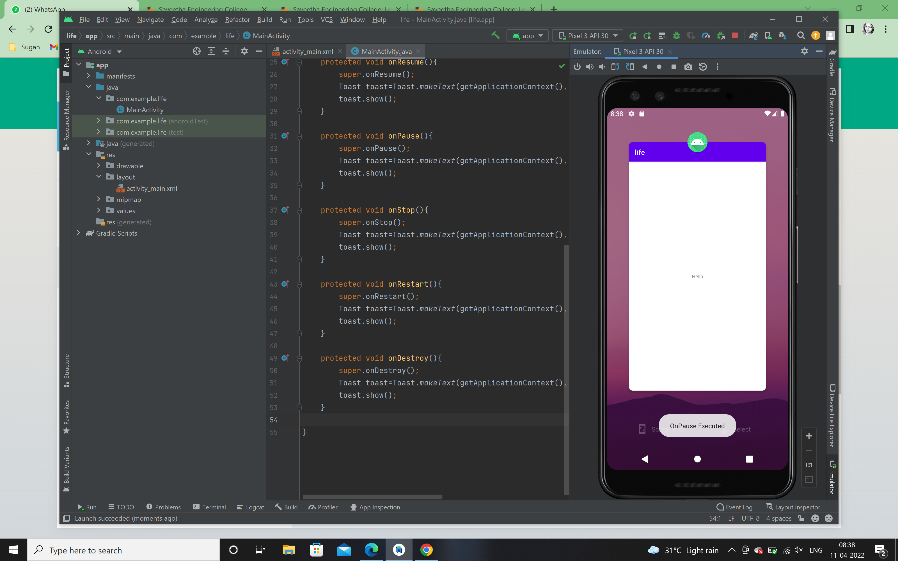
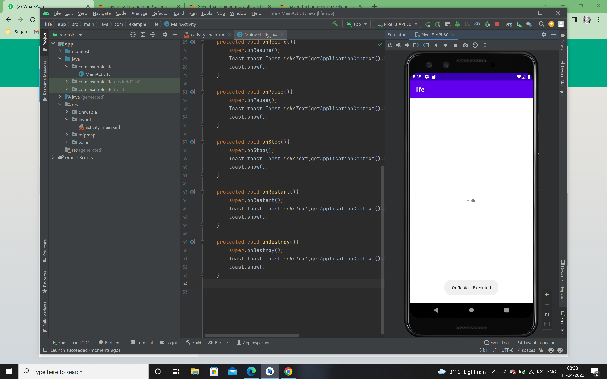
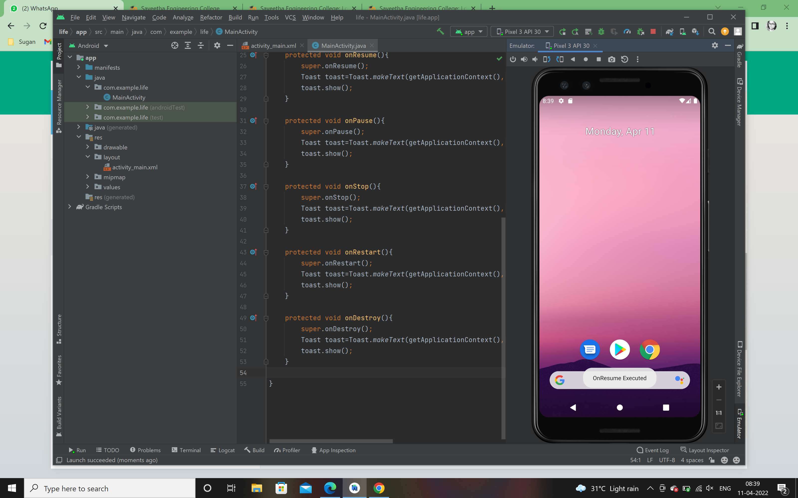
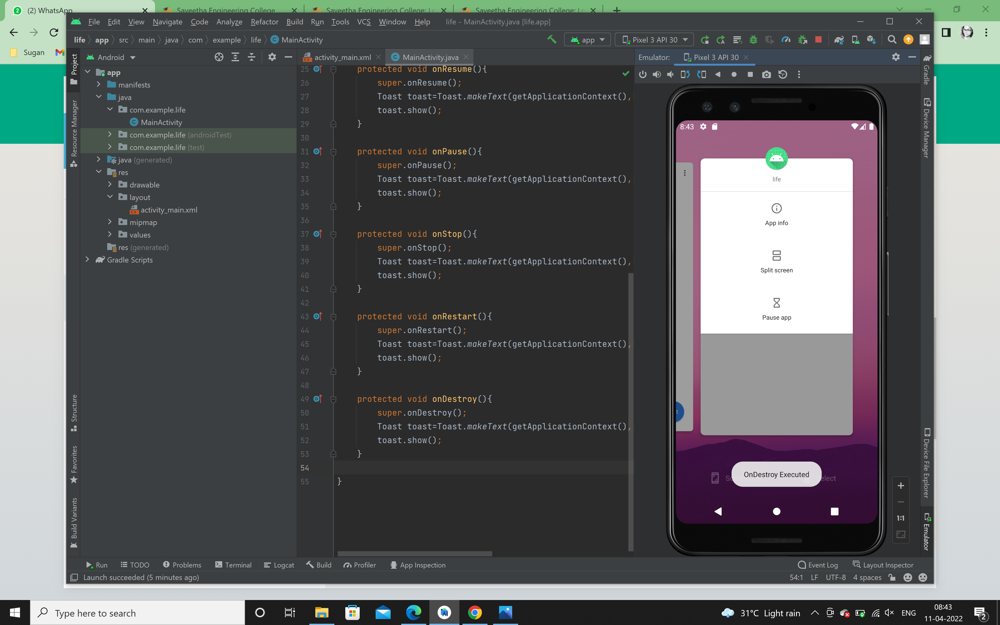

# <p align="center"> Ex.No-1 To create a HelloWorld Activity using all lifecycles methods to display messages </P>

## AIM:

To create a HelloWorld Activity using all lifecycles methods to display messages using Android Studio.

## EQUIPMENTS REQUIRED:

Android Studio(Min. required Artic Fox)

## ALGORITHM:

Step 1: Open Android Stdio and then click on File -> New -> New project.

Step 2: Then type the Application name as “ex.no.1″ and click Next. 

Step 3: Then select the Minimum SDK as shown below and click Next.

Step 4: Then select the Empty Activity and click Next. Finally click Finish.

Step 5: Design layout in activity_main.xml.

Step 6: Display message give in MainActivity file.

Step 7: Save and run the application.

## PROGRAM:
```java
/*
Program to print the text “Hello World”.
Developed by: P.Suganya
Registeration Number : 212220230049
*/

MainActivity.java

package com.example.exnol;
import androidx.appcompat.app.AppCompatActivity; import android.os.Bundle;
import android.widget.Toast;
public class MainActivity extends AppCompatActivity { @Override
protected void onCreate(Bundle savedinstanceState) {
super.onCreate(savedinstanceState); setContentView(R.layout.activity_main);
Toast toast=Toast.mak eText(getApplictaionContext(),"OnCrea te Executed",Toast.LENGTH_LONG); 
toast.show();
}

protected void onStart(){ super.onStart();
Toast toast=Toast.makeText(getApplicationContext(),"OnStart Executed",Toast.LENGTH_LONG); 
toast.show();
}

protected void onResume(){ super.onResume();
Toast toast=Toast.makeText(getApplicationContext(),"OnResume Executed",Toast.LENGTH_LONG);
 
toast.show();
}

protected void onPause(){ super.onPause();
Toast toast=Toast.makeText(getApplicationContext(),"OnPause Executed",Toast.LENGTH_LONG); 
toast.show();
}

protected void onStop(){ super.onStop();
Toast toast=Toast.makeText(getApplicationContext(),"OnStop Executed",Toast.LENGTH_LONG); 
toast.show();
}

protected void onRestart(){ super.onRestart();
Toast toast=Toast.makeText(getApplicationContext(),"OnRestart Executed",Toast.LENGTH_LONG); 
toast.show();
}

protected void onDestroy(){ super.onDestroy();
Toast toast=Toast.makeText(getApplicationContext(),"OnDestroy Executed",Toast.LENGTH_LONG); 
toast.show();
}
}


activity_main.xml

<?xml version=" 1. 0" encoding=" utf-8"? >
<androidx.constraintlayout.widget.Constraintlayout xmlns:android="http://schemas.android.com/
apk/res/android" xmlns:app="http://schemas.android.com/apk/res-auto"
xmlns:tools="http://schemas.android.com/tools" android:layout_width="match_parent"
 
android:layout_height="match_parent" tools:context=".MainActivity">

<TextView
android:layout_width="wrap_content" android:layout_height="wrap_content" android:text="Hello
World!" app:layout_constraintBottom_toBottomOf="parent" app:layout_constraintLeft_toLeftOf=
"parent" app:layout_constraintRight_toRightOf="parent" app:layout_constraintTop_toTopOf="parent" />

</androidx.constraintlayout.widget.ConstraintLayout>


```

## OUTPUT









## RESULT
Thus a Simple Android Application create a HelloWorld Activity using all lifecycles methods to display messages using Android Studio is developed and executed successfully.
